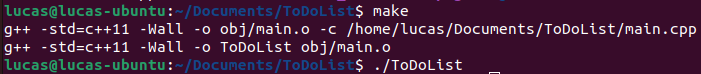

# To-do List
 This repository contains a simple project where I crated a To-Do List program using C++.

Most of the code was developed taking [this video](https://www.youtube.com/watch?v=FcYs8wtzjVE&t=7557s) from [SavvyNik
](https://www.youtube.com/@SavvyNik) as reference.

## Diagram
Bellow is the diagram I created to represent the algorithm for the To-Do List. 

*The diagram was drawn using draw.io and respecting the Standard ISO 5807/1985.*


This simple To-do List allows us to add, remove and keep track of a list of 

## Instructions to MakeFile

According to [Microsoft Documentation](https://learn.microsoft.com/en-us/cpp/build/reference/creating-a-makefile-project?view=msvc-170), a <mark>*MakeFile*</mark> is a text file that contains instructions for how to compile and link (or build) a set of source code files. A program (often called a make program) reads the makefile and invokes a compiler, linker, and possibly other programs to make an executable file.

For this project, I created the makefile using the *"C/C++ Makefile Project"* extension available at Visual Studio Code Extensions.


After creating the Makefile using this extension, it is needed to customize some settings such as the appname and the source directory SRCDIR:
```
# Makefile settings - Can be customized.
APPNAME = ToDoList
EXT = .cpp
SRCDIR = /home/lucas/Documents/ToDoList
OBJDIR = obj
```

Afterwards, when you open a terminal, navigate to the directory informed in SRCDIR and execute a simple **make** command, it will automatically compile any object that it finds in the directory and *Voilà*! An "app" called ToDoList was created and to run it you just have to type *"./ToDoList"* in the terminal.

